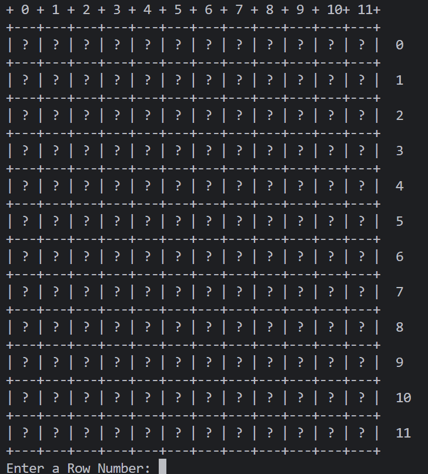
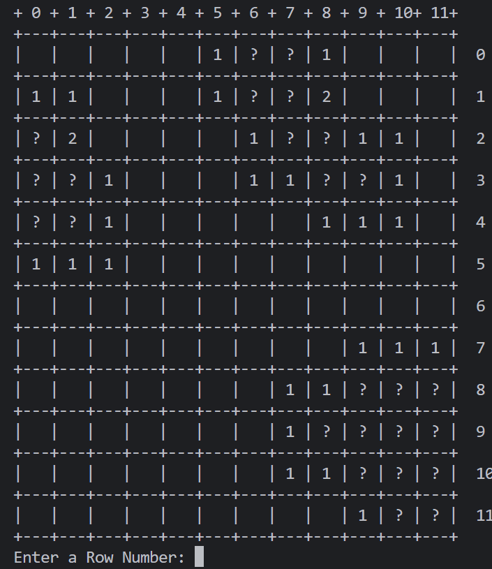
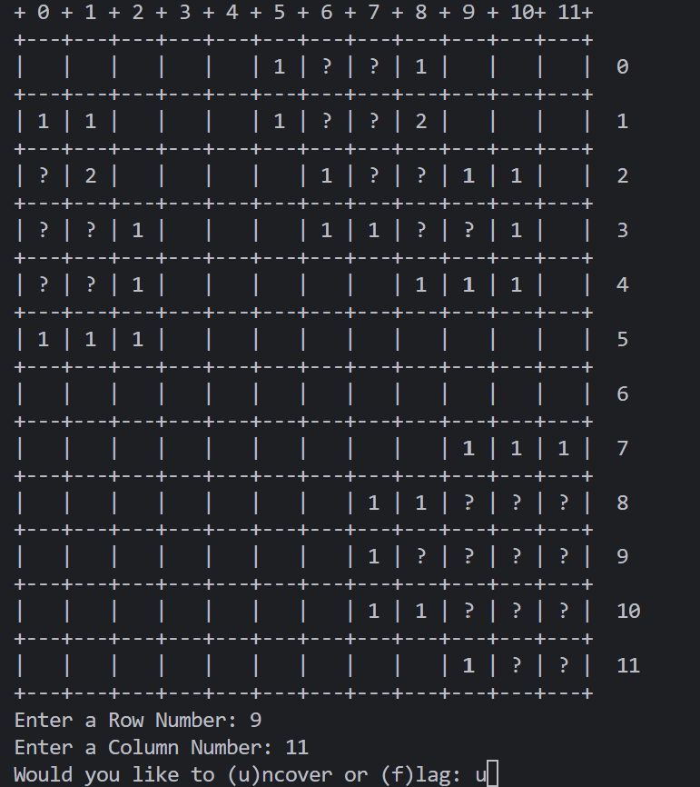
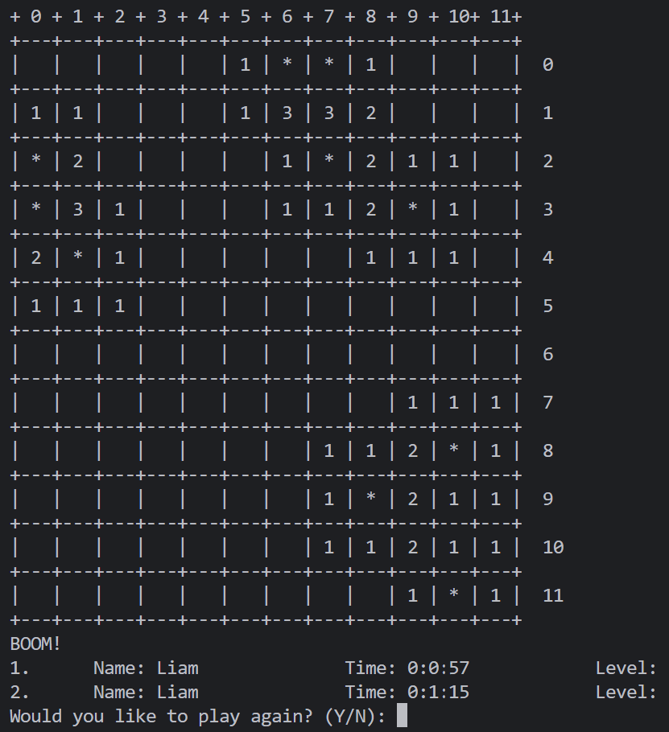
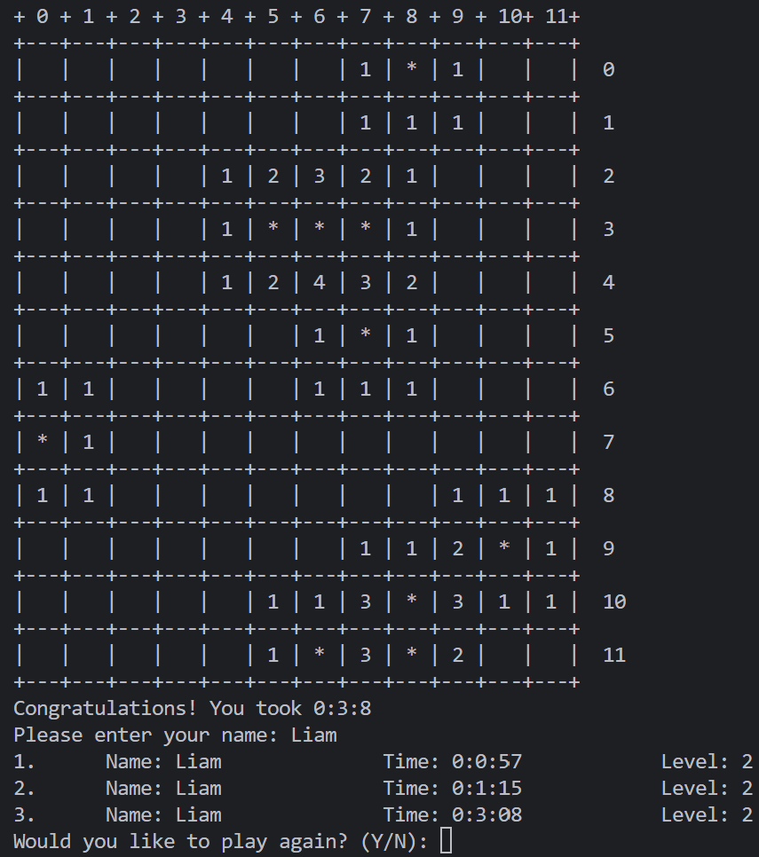
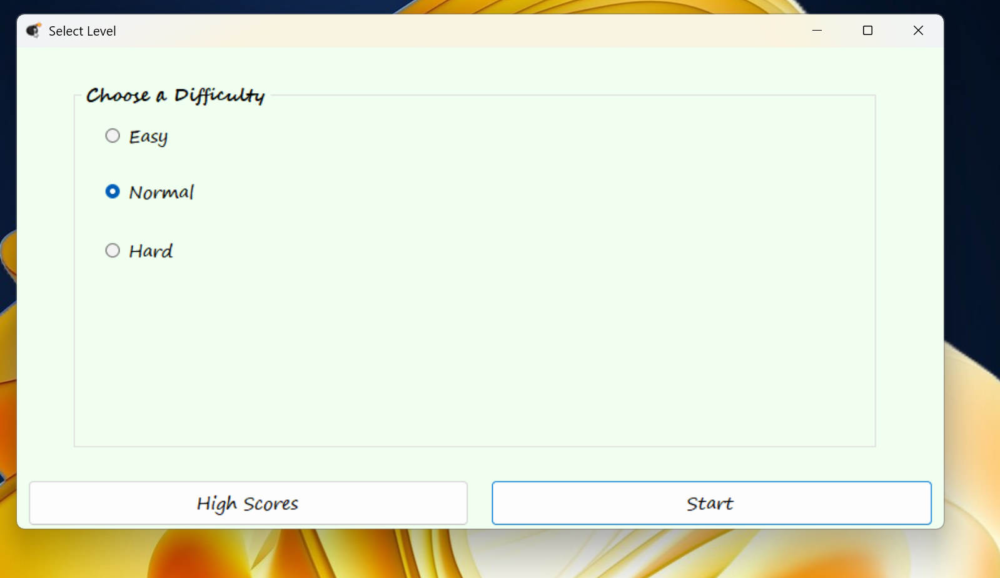
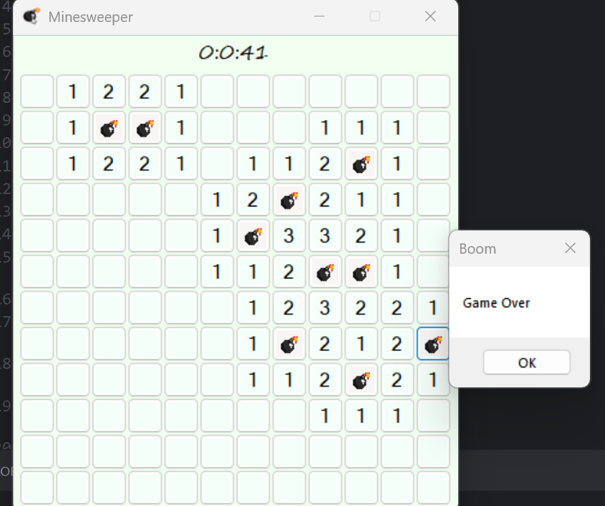
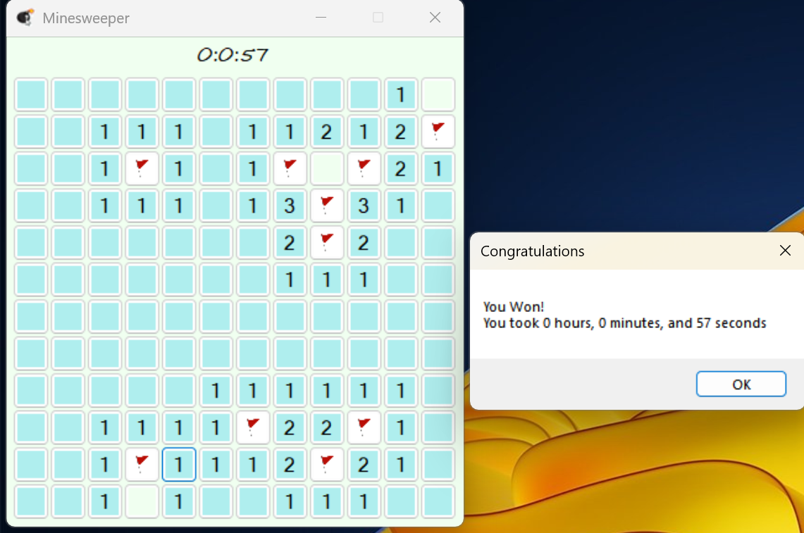
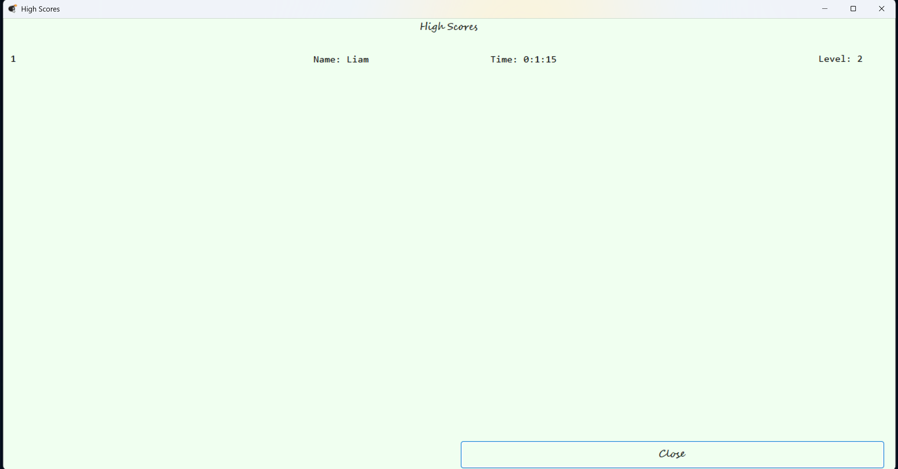

# Minesweeper
## Console Screenshots

The screen upon starting the game   

A scene from mid-game   

How to uncover a tile (in this case, tile (11, 9) in Cartesian format)
  

Losing the game   

Winning the game

## GUI Screenshots

Start screen   

Losing the game   

Winning the game   

High Scores page   

**Note: The Flag and Bomb icons were downloaded off of Google. 
I have no idea if they are copyrighted, I used them only for demonstration purposes**