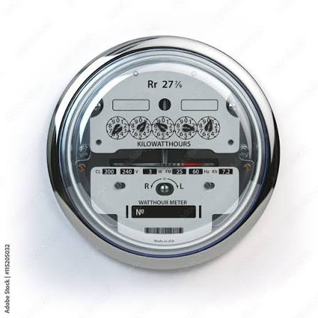

# Portfolio
Portfolio of my various projects, drawn primarily from college assignments. Do not copy this work.

## Battleship
### Language: Java
One of my latest educational projects, and one I am rather proud of. 
This system is designed to simulate a game of BattleShip. <br/>
It is a single-player game. The primary challenge of the project was building the computer's strategy system from scratch.<br/>
I set the computer to use my own strategy in BattleShip:
1. Randomly fire at a tile
2. If I hit a ship:
   1. Fire at an adjacent tile that I haven't hit yet
   2. Repeat until I find the next ship tile
   3. Continue firing in a line from that point, until I reach the end of the ship
   4. Fire along that same line, at the other end of the ship.
   5. If I find another point: Keep firing in that direction, until the ship is sunk
   6. Otherwise, the ship is square-shaped, fire directionally (see steps i and ii) until it is sunk.
3. Repeat until one side wins

The biggest challenge of implementing this method was that it had to be in a method that saved its own state elsewhere. I could not just use a loop or a recursive algorithm, because it needed to stop to let the User play. <br/>
As you can see, I was successful:

This image displays a player's turn, after the computer has found two of their ships. The computer accomplished this quite quickly, taking only a few turns to demolish two out of the three ships once it found them.
<br/>
To run this game, download the repository, download the dependencies with Maven, and run com.leemra.battleship.BattleShip in a modern JVM. (I'm using Java 25, but it should be compatible with at least *some* earlier versions. I believe it was written with Java 21.)

## Minesweeper
### Language: C#/.NET Foundation (Depreciated)
This is one of my oldest college projects - so much so, that the framework that it used, .NET Foundation, is no longer supported. 
I had to do quite a bit of reformatting (only in the .csproj files) to get the thing to run on my laptop. However, it does demonstrate my abilities in C# and Windows Forms, in a completely self-sufficient program that requires little-to-no explanation.
<br>
This project has two modes: GUI and Console. 
<br/> <br/>
**The GUI version is dependent on the Console version, so make sure you have both of them downloaded, and do not touch the project structure (unless you are ready to do a *lot* of editing to the .csproj files).**
<br><br>
This was a very simple project. If I remember correctly, the most difficult part was in the GUI version: I had to programmatically create a 2d array of buttons, and sync those buttons to the existing array of Cells from the Base program.
<br><br>
To run this program, download the repository (again, please do not change the folder structure), open in a modern edition of VS Code (with the C# extensions), navigate to either Minesweeper/MinesweeperBase or Minesweeper/MinesweeperGUI, and run:
```bash
dotnet clean
dotnet buigitld
dotnet run
```
Screenshots can be found in /Minesweeper/screenshots.md or in /Screenshots

## Meter Trainer
### Languages: Kotlin, Java
This is one of my most recent projects. My purpose in making it was to help my father, 
who supervises a meter reading team, train his employees.
<br><br>
It's function is to teach users to read analog electric and water meters, such as the one displayed below.
<br>

<br><br>
It has two modes: Practice and Test. Practice mode shows the user the locations of any errors in their input, test mode does not, instead keeping track of the user's overall score.
<br>
In addition to those two modes, there are three levels. The first level displays numbers (0 and 5) on the dial, and all ten tick marks. The second one shows only the tick marks, and the third shows nothing except for the pointer of the dial.
The tricky part is that each dial spins in the opposite direction of the previous one. (In a 5-dial meter, that would be clockwise, counterclockwise, clockwise, counterclockwise, clockwise, in that order.)
<br><br>
This application displays my abilities with logic, error checking, display, and adapting existing frameworks to serve my purpose.
<br><br>
To run, download the repository, import "pom.xml" as a Maven project, in whichever IDE you please, and run com.leemra.meterReader.MeterReader.kt
<br><br>
Screenshots can be found in MeterReader/screenshots.md or in /Screenshots
